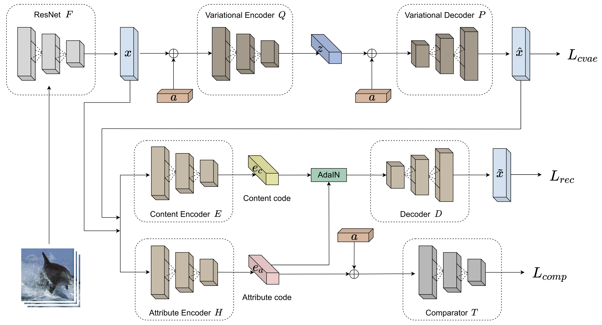

# Content-Attribute Disentanglement for Generalized Zero-Shot Learning (CA-GZSL)

This is the official implementation of CA-GZSL.
<p align="center">
    
</p>

# Environment
- Ubuntu 16.04
- Python 3.7

# Installation
```bash
pip install torch==1.7.0+cu101 torchvision==0.8.1+cu101 torchaudio==0.7.0 -f https://download.pytorch.org/whl/torch_stable.html
pip install -r requirements.txt
```

# Datasets
- We used the same dataset setting as [SDGZSL](https://drive.google.com/file/d/1KxFC6T_kGKCNx1JyX2FOaSimA0DOcU_I/view)
- After downloading the zip file, unzip it in `data` directory.

# Training
- AWA2
```bash
python train.py \
--dataset AWA2 \
--out_dir outputs/AWA2 \
--dataroot data/SDGZSL_data \
--file_name 2400 \
--gpu 0 \
--vae_weight 1.0 \
--relation_weight 0.96 \
--recon_weight 0.099 \
--classifier_steps 50 \
--nSample 2400 \
--S_dim 312 \
--lr 8.02e-05 \
--classifier_lr 0.0009 \
--tc_warmup 0.001 \
--gen_nepoch 400 \
--evl_start 20000 \
--evl_interval 300 \
--manualSeed 6152 \
--finetune true \
--weight_decay 2.95e-07
```

- CUB_STC
```bash
python train.py \
--dataset CUB_STC \
--out_dir outputs/CUB_STC \
--dataroot data/SDGZSL_data \
--file_name 800 \
--gpu 0 \
--vae_weight 4.3 \
--relation_weight 0.07 \
--recon_weight 4.0 \
--beta 0.3 \
--nSample 800 \
--lr 5.2e-06 \
--classifier_lr 0.00022 \
--kl_warmup 0.02 \
--weight_decay 4.9e-09 \
--finetune true
```

- FLO_EPGN
```bash
python train.py \
--dataset FLO_EPGN \
--out_dir outputs/FLO_EPGN \
--dataroot data/SDGZSL_data \
--file_name 2800 \
--gpu 0 \
--vae_weight 3.15 \
--relation_weight 1.25 \
--recon_weight 3.64 \
--beta 0.1 \
--nSample 2800 \
--S_dim 2048 \
--lr 3.9e-06 \
--classifier_lr 0.00065 \
--weight_decay 3.5e-09 \
--kl_warmup 0.001 \
--vae_dec_drop 0.4 \
--finetune true
```

- aPY
```bash
python train.py \
--dataset APY \
--out_dir outputs/APY \
--dataroot data/SDGZSL_data \
--file_name 1200 \
--gpu 0 \
--vae_weight 0.66 \
--relation_weight 0.51 \
--recon_weight 0.41 \
--classifier_steps 20 \
--nSample 1200 \
--lr 3.2e-05 \
--gen_nepoch 250 \
--kl_warmup 0.001 \
--tc_warmup 0.0003 \
--weight_decay 2.3e-06 \
--classifier_lr 0.0017 \
--evl_interval 200 \
--finetune true \
--manualSeed 3861
```

# Evaluation
You can download the pretrained weights and check the training logs from this [link](https://drive.google.com/drive/folders/1yHiT_ddCKRleBqe6z_cFRdRRoVD27imP?usp=sharing
- AWA2
```bash
python eval.py \
--dataset AWA2 \
--dataroot data/SDGZSL_data \
--ckpt_path outputs/AWA2/Best_model_GZSL_AWA2_finetune_True_2400.pth \
--gpu 0 \
--vae_weight 1.0 \
--relation_weight 0.96 \
--recon_weight 0.099 \
--classifier_steps 50 \
--nSample 2400 \
--S_dim 312 \
--lr 8.02e-05 \
--classifier_lr 0.0009 \
--tc_warmup 0.001 \
--gen_nepoch 400 \
--evl_start 20000 \
--evl_interval 300 \
--manualSeed 6152 \
--finetune true \
--weight_decay 2.95e-07
```

- CUB_STC
```bash
python eval.py \
--dataset CUB_STC \
--dataroot data/SDGZSL_data \
--ckpt_path outputs/CUB_STC/Best_model_GZSL_CUB_finetune_True_800.pth \
--gpu 0 \
--vae_weight 4.3 \
--relation_weight 0.07 \
--recon_weight 4.0 \
--beta 0.3 \
--nSample 800 \
--lr 5.2e-06 \
--classifier_lr 0.00022 \
--kl_warmup 0.02 \
--weight_decay 4.9e-09 \
--finetune true
```

- FLO_EPGN
```bash
python eval.py \
--dataset FLO_EPGN \
--dataroot data/SDGZSL_data \
--ckpt_path outputs/FLO_EPGN/Best_model_GZSL_FLO_finetune_True_2800.pth \
--gpu 0 \
--vae_weight 3.15 \
--relation_weight 1.25 \
--recon_weight 3.64 \
--beta 0.1 \
--nSample 2800 \
--S_dim 2048 \
--lr 3.9e-06 \
--classifier_lr 0.00065 \
--weight_decay 3.5e-09 \
--kl_warmup 0.001 \
--vae_dec_drop 0.4 \
--finetune true
```

- aPY
```bash
python eval.py \
--dataset APY \
--dataroot data/SDGZSL_data \
--ckpt_path outputs/APY/Best_model_GZSL_APY_finetune_True_1200.pth \
--gpu 7 \
--vae_weight 0.66 \
--relation_weight 0.51 \
--recon_weight 0.41 \
--classifier_steps 20 \
--nSample 1200 \
--lr 3.2e-05 \
--gen_nepoch 250 \
--kl_warmup 0.001 \
--tc_warmup 0.0003 \
--weight_decay 2.3e-06 \
--classifier_lr 0.0017 \
--evl_interval 200 \
--finetune true \
--manualSeed 3861
```


# Citation
```
@ARTICLE{9784824,
  author={An, Yoojin and Kim, Sangyeon and Liang, Yuxuan and Zimmermann, Roger and Kim, Dongho and Kim, Jihie},
  journal={IEEE Access}, 
  title={Content-Attribute Disentanglement for Generalized Zero-Shot Learning}, 
  year={2022},
  volume={10},
  number={},
  pages={58320-58331},
  doi={10.1109/ACCESS.2022.3178800}}
```
